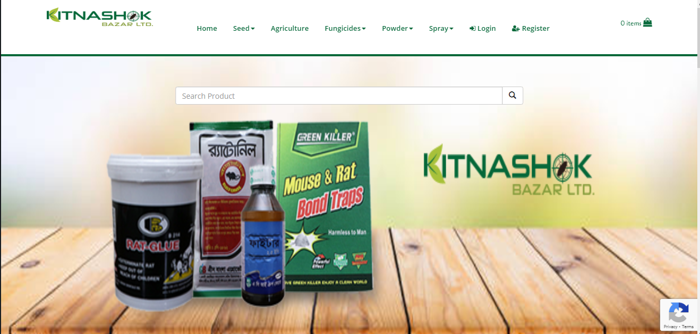
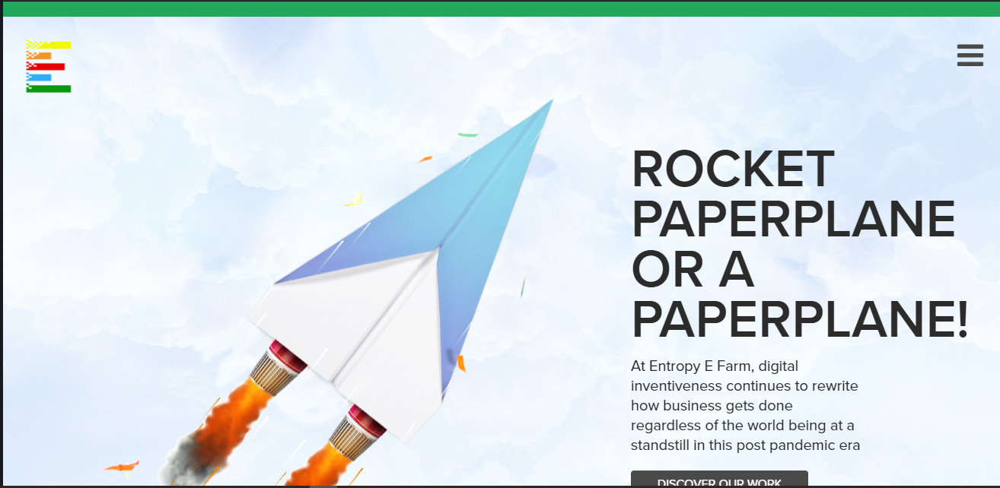
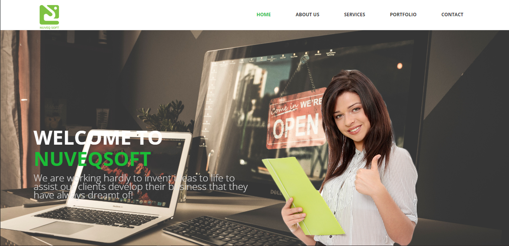
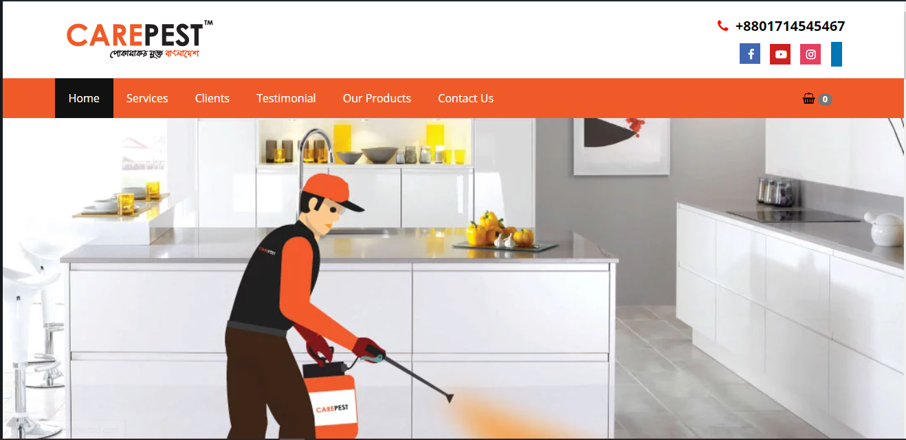
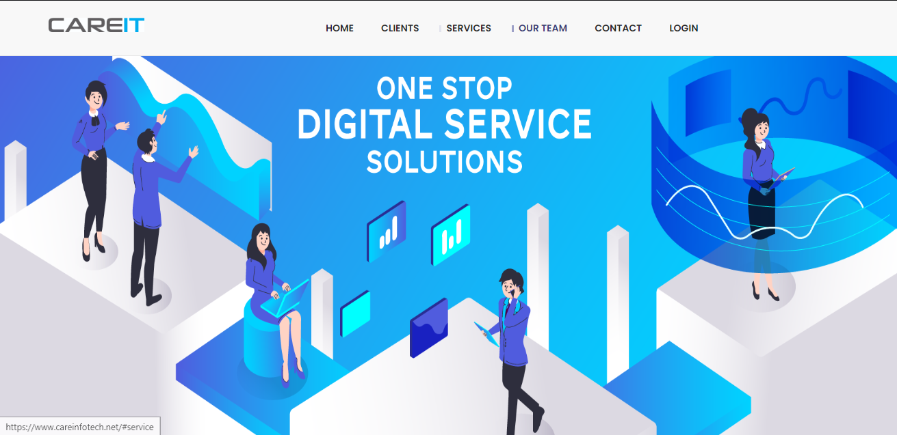
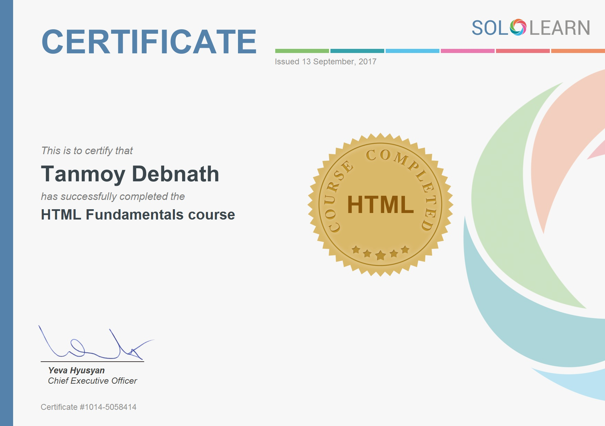
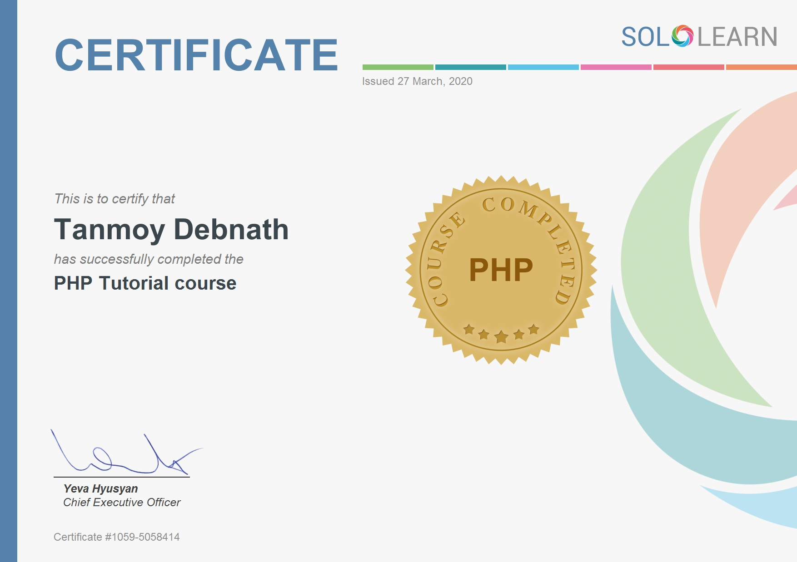

<!DOCTYPE html>
<html lang="en">

<meta http-equiv="content-type" content="text/html;charset=UTF-8" />
<head>
  <meta charset="UTF-8" />
  <meta http-equiv="X-UA-Compatible" content="IE=edge">
  <meta name="viewport" content="width=device-width, initial-scale=1, maximum-scale=1" />
<title>Tanmoy Debnath | Network Engineer - Web Developer</title>
<meta name="generator" content="Tanmoy Debnath" />
<meta property="Tanmoy" content="Tanmoy Debnath Portfolio" />
<meta name="description" content="Tanmoy Debnath | Network Engineer - Web Developer">
<meta name="keywords" content="HTML, CSS, JavaScript, Networking, IT, PHP, Laravel">
<meta name="author" content="Tanmoy Debnath">

<!-- Load Fonts -->
  <link href="https://fonts.googleapis.com/css?family=Poppins:100,100i,200,200i,300,300i,400,400i,500,500i,600,600i,700,700i,800,800i,900,900i" rel="stylesheet">

  <link rel="preload"  as="style" onload="this.onload=null;this.rel='stylesheet'" href="assets/fontawesome/css/all.css"> <!--load all styles -->

  <!-- Load CSS -->
  <link rel="preload"  as="style" onload="this.onload=null;this.rel='stylesheet'" href="assets/css/style.css">
  <link rel="preload"  as="style" onload="this.onload=null;this.rel='stylesheet'" href="assets/css/ionicons.css" />
  <link rel="preload"  as="style" onload="this.onload=null;this.rel='stylesheet'" href="assets/css/magnific-popup.css" />
  <link rel="preload"  as="style" onload="this.onload=null;this.rel='stylesheet'" href="assets/css/animate.css" />
  <link rel="preload"  as="style" onload="this.onload=null;this.rel='stylesheet'" href="assets/css/owl.carousel.css" />
  <link rel="preload"  as="style" onload="this.onload=null;this.rel='stylesheet'" href="assets/css/syntax.css" />

  <!--[if lt IE 9]>
  
  
  <![endif]-->

  <!-- Favicons -->
  <link rel="shortcut icon" sizes="192x192" href="assets/images/favicons/favicon (1).ico">

  </head>

<body class=" home">

    

      <!-- preloader 
      

        

          

            

              

              

            

          

        

      

      -->

      <!-- background -->
      

        <ul class="bg-bubbles">
          <li></li>
          <li></li>
          <li></li>
          <li></li>
          <li></li>
          <li></li>
          <li></li>
          <li></li>
          <li></li>
          <li></li>
        </ul>
      

      <!-- Container -->
      

<!-- Header -->
<header class="header">

	<!-- menu -->
	

		<ul>

			<li class="active">
				<a href="index.php#about-card">
					
					About
				</a>
			</li>

			<li>
				<a href="index.php#resume-card">
					
					Resume
				</a>
			</li>

			<li>
				<a href="index.php#works-card">
					
					Works
				</a>
			</li>

			<li>
				<a href="index.php#blog-card">
					
					Certificate
				</a>
			</li>

				<li>
				<a href="index.php#testimonial-card">
					
					Testimonial
				</a>
			</li>

			<li>
				<a href="index.php#contacts-card">
					
					Contact
				</a>
			</li>

		</ul>
	

</header>

<!-- Card - Started -->

  <!--
    Profile
  -->
  

    <!-- profile image -->
    

    <!-- profile photo -->

    <!-- profile titles -->
    
Tanmoy Debnath

    

      

        
Network Enginner

		    
Web Developer

        
Blogger

        
Freelancer

      

    

    <!-- profile socials -->
    

      <a target="_blank" href="https://www.facebook.com/tanmoy.debnath.pappu" title="Facebbok"></a>

      <a target="_blank" href="https://twitter.com/tanmoy_tonu12" title="Twitter"></a>

      <a target="_blank" href="https://github.com/Tanmoy-Debnath" title="GitHub"></a>

      <a target="_blank" href="https://www.linkedin.com/in/tanmoy-debnath-14a180120/" title="linkedin"></a>

      <a target="_blank" href="https://www.instagram.com/tanmoy_tonuu" title="instagram"></a>

    

    <!-- profile buttons 

    

      https://docs.google.com/uc?export=download&id=1MTWJGcX56XpvK6t38MYrbKgNKstgjz98 
      <a href="#" onclick="myFunction()"  class="lnk">
        Download CV

      </a>

      <a href="mailto:tanmoy.bubt@gmail.com" class="lnk">
        Contact Me

      </a>

    

-->

  

<!-- Card - About -->

	

<!-- About -->

	<!-- title -->
	
About Me

	<!-- content -->
	

		

			

				 
 <strong>Hello! I’m Tanmoy Debnath.</strong> Mikrotik Certified Network Enginner and Web Developer from Bangladesh. I have rich experience in configuring, troubleshooting, Routing & Switching , also I am proficient in several programming and scripting languages. 

			

		

		

			

				<ul>

					<li><strong>Age: </strong> 26</li>

					<li><strong>Residence: </strong> Bangladesh</li>

					<li><strong>Freelance: </strong> Available</li>

					<li><strong>Address: </strong> Dhaka, Bangladesh</li>

				</ul>
			

		

		

	

<!-- Services -->

	<!-- title -->
	
My Services

	<!-- content -->
	

		<!-- service item -->
		

			

				
<i class="fas fa-network-wired"></i>

				
IT/Systems Support

				

				IT/Systems Support for enterprises and startups.
				

			

		

	<!-- service item -->
	

			

				

				
Web Development

				

					Modern and mobile-ready website that will help you reach all of your marketing.
				

			

		

		<!-- service item -->
		

			

				
<i class="fas fa-project-diagram"></i>

				
Network/Helpdesk Support

				

				Network/Helpdesk Support for ISPs, enterprises and startups.
				

			

		

<!-- service item -->

			

				
<i class="fas fa-server"></i>

				
Network Installation and Maintenance

				

				Network installation and maintenance for your organization.
				

			

		

		

	

<!-- Clients -->

	<!-- title -->
	
Clients

	<!-- content -->
	

		<!-- client item -->
		

			

				

					
				

			

		

		<!-- client item -->
		

			

				

					
				

			

		

		<!-- client item -->
		

			

				

					
				

			

		

		<!-- client item -->
		

			

				

					
				

			

		

    	<!-- client item -->
		

			

				

					
				

			

		

<!-- client item -->

			

				

					
				

			

		

<!-- client item -->

			

				

					
				

			

		

<!-- client item -->

			

				

					
				

			

		

		

	

	

<!-- Card - Resume -->

	

<!-- Resume -->

	<!-- title -->
	
Resume

	<!-- content -->
	

		<!-- experience -->
		

			

				
<i class="ion ion-briefcase"></i>

				
Experience

			

			

        

          
2021 - Present

          
IT Officer

          
ABA Group

          

            Network Monitoring, troubleshooting wireless Device & server base update.
          

        

        

          
2018 - 2020

          
IT Officer

          
Care Info Tech Ltd.

          

            Collaborate with creative and development teams on the execution of ideas.
          

        

				

					
2018 - 2019

					
Web Developer

					
Southeast BD

					

						Monitored technical aspects of the front-end and back-end delivery for several projects.
					

				

				

					
2018 - 2020

					
Senior Developer

					
NuveQSoft

					

						Developed website performance using latest technology.
					

				

			

		

		<!-- education -->
		

			

				
<i class="ion ion-university"></i>

				
Education

			

			

				

					
2013 - 2018

					
Bachelor's Degree in Computer Science and Engineering

					
Dhaka,Mirpur

					

					Bangladesh University of Business and Technology(BUBT)
					

				

				

					
2010 - 2012

					
HSC - Science

					
Dhaka State College

					

						Dhaka, Mohammadpur
					

				

				

					
2010 - 

					
SSC - Science

					
Baghoon High School

					

						Dhaka, Gazipur
					

				

			

		

		

	

<!-- Skills -->

	<!-- title -->
	
My Skills

	<!-- content -->
	

		<!-- skill item -->
		

			

				

					
<i class="ion ion-easel"></i>

					
Networking

				

				<ul>

					<li class="border-line-h">
						
Routing & Switching

						

							

						

					</li>

					<li class="border-line-h">
						
Troubleshooting

						

							

						

					</li>

					<li class="border-line-h">
						
IT/Systems Support

						

							

						

					</li>

					<li class="border-line-h">
						
Network Installation and Maintenance

						

							

						

					</li>

				</ul>
			

		

		<!-- skill item -->
		

			

				

					
<i class="ion ion-flag"></i>

					
Languages

				

				<ul>

					<li class="border-line-h">
						
English

						

							

						

					</li>

					<li class="border-line-h">
						
Bengali

						

							

						

					</li>

					<li class="border-line-h">
						
Hindi

						

							

						

					</li>

				</ul>
			

		

		<!-- skill item -->
		

			

				

					
<i class="ion ion-code"></i>

					
Coding

				

				<ul>

					<li>
						
WordPress

						

							90%
						

					</li>

					<li>
						
PHP / MYSQL

						

							75%
						

					</li>

					<li>
						
Angular / JavaScript

						

							85%
						

					</li>

					<li>
						
HTML / CSS

						

							95%
						

					</li>

				</ul>
			

		

		<!-- skill item -->
		

			

				

					
<i class="ion ion-android-list"></i>

					
Knowledge

				

				<ul>

					<li>
						
Website hosting

					</li>

					<li>
						
Routing & Switching

					</li>

					<li>
						
IT/Systems Support

					</li>

					<li>
						
Network Installation and Maintenance

					</li>

					<li>
						
Network/Helpdesk Support

					</li>

					<li>
						
Web Development

					</li>

					<li>
						
Web Design

					</li>

					<li>
						
E-commerce Website Development

					</li>

				</ul>
			

		

		

	

	

<!-- Card - works -->

	

<!-- Works -->

	<!-- title -->
	
Recent Works

	<!-- filters -->
	

		

			<label><input type="radio" name="fl_radio" value="grid-item" />All</label>
		

		

			<label><input type="radio" name="fl_radio" value="photo" />Website</label>
		

		

			<label><input type="radio" name="fl_radio" value="video" />E-Commerce</label>
		

		

	

	<!-- content -->
	

		<!-- work item video -->
		

			

				

					
				

				

					
S.A Cell Phone

				

			

		

		<!-- work item video -->
		

			

				

					
				

				

					
Kitnashok Bazar BD

				

			

		

		<!-- work item video -->
		

			

				

					
				

				

					
Crazy Bazar

				

			

		

                                 <!-- Website -->

		<!-- work item photo -->
		

			

				

				
				

				

					
Entropy E Farm

				

			

		

			<!-- work item photo -->
			

			

				

				
				

				

					
NuveQsoft BD 

				

			

		

			<!-- work item photo -->
			

			

				

				
				

				

					
Care Pest BD 

				

			

		

<!-- work item photo -->

			

				

				
				

				

					
Care Force BD 

				

			

		

		<!-- work item photo -->

			

				

				
				

				

					
Care Info Tech 

				

			

		

		

	

	

                                            

<!-- Certification -->

	

<!-- Blog -->

	<!-- title -->
	
Certificate

	<!-- content -->
	

		<!-- work item photo -->
		

			

				

					<a href="assets/img/works/mikrotik.jpg" class="has-popup-image">
						
						
							
						
					</a>
				

				

					<a href="assets/img/works/mikrotik.jpg" class="name has-popup-image">Mikrotik Certificate</a>

				

			

		

<!-- work item photo -->
		

			

				

					<a href="assets/img/works/html.jpg" class="has-popup-image">
						
						
							
						
					</a>
				

				

					<a href="assets/img/works/html.jpg" class="name has-popup-image">HTML Fundamentals</a>

				

			

		

<!-- work item photo -->
		

			

				

					<a href="assets/img/works/css.jpg" class="has-popup-image">
						
						
							
						
					</a>
				

				

					<a href="assets/img/works/css.jpg" class="name has-popup-image">CSS Fundamentals</a>

				

			

		

<!-- work item photo -->
		

			

				

					<a href="assets/img/works/php.jpg" class="has-popup-image">
						
						
							
						
					</a>
				

				

					<a href="assets/img/works/php.jpg" class="name has-popup-image">PHP Fundamentals</a>

				

			

		

		

	

	

                                                               <!-- Testimonial -->

	

	                                                                <!-- title -->
	
Testimonials

	<!-- content -->
	

		<!-- client item -->
		

			

				

					

						

							

							Excellent, working with Tanmoy Debnath was great. I am recommend anyone that is looking for a custom website to give them a call and speak to Gus, he will guide you to the right direction.
							

							

								

								

									
Rana Ahmed

									
CEO of Entropy E Farm

								

								

							

						

					

					

						

							

							Tanmoy Debnath have taken our business to the next level. I will sure use them for all my upcoming projects and recommend them !!
							

							

								

								

									
Saiful Islam

									
CEO of Care Force BD

								

								

							

						

					

					

						

							

							Excellent skill with good understanding on given task. Perfect guy for Network Project.
							

							

								

								

									
Mr. Jamil

									
IT Specialist

								

								

							

						

					

				

			

		

		

	

	

                                                      <!-- Card - Contact -->

	

<!-- Conacts Info -->

	<!-- title -->
	
Get in Touch

	<!-- content -->
	

		

			

<iframe class="lazy" data-src="https://www.google.com/maps/embed?pb=!1m18!1m12!1m3!1d58403.65890250301!2d90.32726109792911!3d23.81046589717431!2m3!1f0!2f0!3f0!3m2!1i1024!2i768!4f13.1!3m3!1m2!1s0x3755c0c1c61277db%3A0xc7d18838730e2e59!2sMirpur%2C%20Dhaka!5e0!3m2!1sen!2sbd!4v1598437553804!5m2!1sen!2sbd" width="700" height="350" frameborder="1" style="border:0;" allowfullscreen="" aria-hidden="false" tabindex="0"></iframe>

			

			

				<ul>

					<li><strong>Address: </strong> Mirpur,Dhaka</li>

					<li><strong>Email: </strong> tanmoy.bubt@gmail.com</li>

					<li><strong>Phone: </strong> +880 1685726839</li>

					<li><strong>Freelance: </strong> Available</li>

				</ul>
			

		

		

	

<!-- Contact Form -->

	<!-- title -->
	
Contact Form

	<!-- content -->
	

		

			

				<form id="cform" action="https://formsubmit.co/tanmoy.bubt@gmail.com" method="POST">

              <input type="hidden" name="_next" value="http://tanmoyit.epizy.com/thanks.php">

					

						

							

								<input type="text" name="name" placeholder="Full Name" id="name" />
							

						

						

							

								<input type="text" name="email" placeholder="Email Address" id="email" />
							

						

						

							

								<textarea name="message" placeholder="Your Message" id="message"></textarea>
							

						

					

					

						<a href="#" class="button" onclick="$('#cform').submit(); return false;">
							Send Message
							
						</a>
					

				</form>
			

		

		

	

	

      

    
<!-- Plugins -->

    <!-- Custom -->
    

    

</body>

</html>
